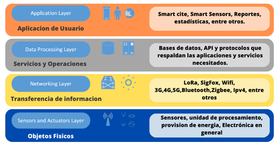

## Mas informacion del proyecto

 para el uso del proyecto de grado. cabe destacar que se utilizo la pila FARM la cual contaba con la siguientes tecnologias, FastApi, React y Mongodb. ademas, fue indispensable la utilizacion de otra tecnologia, como lo fue el protocolo MQTT (Broker), el cual se utilizo Mosquitto MQTT.

 #### Internet de las cosas(IoT)
cuando mencionamos IoT, nos referimos a la interconexion de objetos cotidianos que facilitan la comunicacion inteligente y la automatizacion de tareas mediantes redes inalambricas. esto habilita la recopilacion y el analisis de datos, permitiendo la captura en tiempo real, monitoreo remoto y la automatización de procesos. El IoT tiene el pontencial de transformar diversar industrias y sectores al permitir la generación de datos masivos y la toma de decisiones basada en datos optimizando asi la efiencia, creando nuevas oportunidadades comerciales y mejorando la calidad de vida. [RedHat](https://www.redhat.com/es/topics/internet-of-things/what-is-iot)

 #### Arquitectura de IoT
esta arquitectura de Iot esta organizada en varias capas interconectadas, estas capas se diseñan para facilitar la comunicacion eficiente y la gestion inteligente, en el cual garantiza las operaciones conectando el mundo fisico con el mundo virtual, facilitando asi la comunicacion eficiente y la gestion inteligente de los eventos en el ecosistema IoT.

> A continuación, se describe la arquitectura de 4 capas, mostrada en la figura; esta arquitectura fue tomada de [(HIOTRON, 2019)](https://www.hiotron.com/iot-architecture-layers/)
  

#### Componentes y plataformas de internet de las cosas
 [Según Muñoz](https://books.google.com.co/books?id=vnnEDwAAQBAJ&pg=PT3&hl=es&source=gbs_toc_r&cad=2#v=onepage&q&f=false) los componentes de Internet de las Cosas son las partes fundamentales de cualquier solución que utiliza esta tecnología, independiente de su aplicabilidad para darles a las cosas la capacidad de sentir o recopilar información, se necesitan cosas llamadas sensores. 

 ##### Conectividad
La conectividad en el IoT se logra mediante diferentes protocolos en tecnologias de redes como Bluetooth, banda ancha sobre cable coaxial, fibra óptica o cables de cobre, Zigbee, NFC, celular (por ejemplo, 3G, 4G, 5G), Sigfox, LoRaWAN, NB-IoT y **Wi-Fi(Wireless Fidelity)**, entre otras segun [Oracle](https://www.oracle.com/co/internet-of-things/what-is-iot/). Estas tecnologías brindan la infraestructura necesaria para establecer conexiones confiables y seguras entre dispositivos, permitiendo el intercambio bidireccional de información [Muñoz](https://books.google.com.co/books?id=vnnEDwAAQBAJ&pg=PT3&hl=es&source=gbs_toc_r&cad=2#v=onepage&q&f=false)

Esta última utilizar un tipo de modulación por radiofrecuencia OFDM/OFDMA, logrando la transmisión de datos de alta velocidad y confiable en las redes WiFi modernas, ademas la tecnología WiFi revoluciona la conectividad al posibilitar la comunicación inalámbrica mediante radiofrecuencia. Al emplear estándares como IEEE 802.11, permite enlazar dispositivos en redes locales (LAN) y acceder a Internet sin cables físicos, [tp-link](https://www.tp-link.com/cac/blog/34/wifi-qu%C3%A9-es-wifi-/). WiFi redefine la manera en que los dispositivos se comunican y acceden a la información en entornos digitales

> Las principales características del protocolo son.

| Protocolo| Frecuencia | Alcance | Tasas de datos | Estándar |
|----------|----------|----------|----------|----------|
| WiFi/802.11   | 2,4 GHz y 5 GHz   | 50 m aprox   | 150-600 Mbps | 802.11 |

##### Sensores
[De acuerdo con Muñoz](https://books.google.com.co/books?id=vnnEDwAAQBAJ&pg=PT3&hl=es&source=gbs_toc_r&cad=2#v=onepage&q&f=false), un aspecto clave dentro del panorama del IoT es la incorporación de sensores, elementos esenciales que permiten a estos dispositivos captar información de su entorno y contribuir al flujo constante de datos en la red. Estos abarcan desde pequeños dispositivos que están diseñados para detectar y medir diversos parámetros del entorno, como temperatura, humedad, luz, UV, movimiento, entre otros, hasta infraestructuras complejas como sistemas de transporte inteligentes y ciudades conectadas. El IoT aprovecha la potencia de la conectividad para ofrecer soluciones inteligentes y automatizadas .

###### Características de los sensores
se describe las características clave de los sensores, las cuales son fundamentales al elegir el tipo adecuado de sensor para utilizar en aplicaciones de Internet de las Cosas. 

> Característica de los sensores [Muñoz](https://books.google.com.co/books?id=vnnEDwAAQBAJ&pg=PT3&hl=es&source=gbs_toc_r&cad=2#v=onepage&q&f=false)

| Sensibilidad| Condiciones Ambientaleso|
|----------|----------|
| Rango| Sobrecarga|
| Precisión| Vida útil|
| Resolución| Formato de salida|
| Desvío(offset)| Costo|
| Linealidad| Tamaño|
| Tiempo de respuesta| Peso|
| Estabilidad| Fuente de alimentación|

##### Plataforma de IoT
Las plataformas IoT tienen la función de conectar una red local de dispositivos IoT con la nube, Además, estas plataformas permiten crear aplicaciones en la nube y adaptarse a otras tecnologías para que los usuarios puedan acceder a ellas desde cualquier lugar del mundo

En la actualidad, se encuentran disponibles diversas plataformas de IoT en el mercado. Gigantes tecnológicos como Google, Microsoft y Amazon Web Services (AWS); que es una plataforma de servicios en la nube ofrecida por Amazon, abarcando una amplia gama de servicios y soluciones para alojar, administrar y escalar aplicaciones en la nube. Además también existen múltiples alternativas tanto de código abierto como gratuitas
